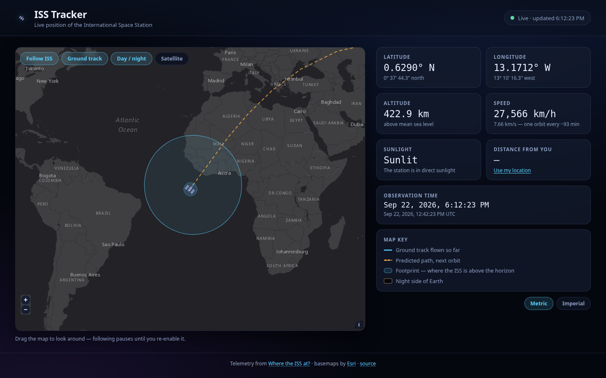

<h1 align="center">ISS Tracker</h1>

<p align="center">
  A live map of the International Space Station — where it is, where it has been,
  and where it is going next.
</p>

<p align="center">
  
</p>

<p align="center">
  <strong><a href="https://anandpiyush21.github.io/ISS_Tracker/">View the live tracker &rarr;</a></strong>
</p>

<p align="center">
  <a href="#running-it">Run it</a> ·
  <a href="#what-it-does">Features</a> ·
  <a href="#how-it-works">How it works</a> ·
  <a href="#data-sources">Data</a>
</p>

---

The station circles the Earth roughly every 93 minutes at about 7.7 km/s. This page
plots that in real time: a marker that glides across the map, the ground it has
covered, the ground it is about to cover, the patch of Earth that can currently see
it, and the line between day and night.

It is a single static page — plain HTML, CSS and JavaScript, no build step, no
framework, no bundler. Open the file and it runs.

## What it does

**On the map**

| | |
|---|---|
| **Live marker** | Position samples arrive every two seconds; the marker is animated between them so the station glides instead of jumping. |
| **Ground track** | The path already flown, drawn from the samples collected since the page loaded (about 30 minutes' worth). |
| **Predicted path** | The next full orbit, queried ahead of time from the API and re-anchored to the marker as the station moves. |
| **Footprint** | The circle on the ground from which the station is above the horizon — roughly 2,300 km in radius. |
| **Day / night** | The solar terminator, computed in the browser from the Sun's apparent position. |

**In the telemetry panel**

- Latitude and longitude, in decimal degrees and in degrees/minutes/seconds
- Altitude and speed, in metric or imperial units
- Whether the station is in sunlight or in the Earth's shadow
- Observation time in your local timezone and in UTC
- Distance from you, if you grant location access — both the straight-line
  distance to the station and whether it is currently above your horizon

**Controls** — follow the station or pan freely, show or hide the track overlays and
the night shading, and switch between a dark canvas basemap and satellite imagery.
Your choices are remembered in `localStorage`.

## Running it

No dependencies to install. Serve the directory over HTTP:

```bash
git clone https://github.com/Anandpiyush21/ISS_Tracker.git
cd ISS_Tracker
python3 -m http.server 8000
```

Then open <http://localhost:8000>.

> A web server is needed rather than opening `index.html` directly: browsers block
> `fetch` and map tiles from `file://` pages. Any static server works — `npx serve`,
> `php -S localhost:8000`, a VS Code Live Server extension.

**Deploying** is just as simple, since the output is already static. This repository
is published to GitHub Pages from the `main` branch root, at
<https://anandpiyush21.github.io/ISS_Tracker/>; the same files work unchanged on
Netlify, Vercel or any static host.

## How it works

```
index.html    Markup and the two CDN tags (OpenLayers script + stylesheet)
style.css     Theme tokens, layout, responsive rules
app.js        All behaviour, in one IIFE
iss.png       Station marker
favicon.png   Tab icon
```

`app.js` is organised top to bottom as: configuration constants → geodesy and
formatting helpers → terminator maths → map construction → geometry updates →
the telemetry loop → rendering → controls → boot.

A few parts are worth calling out.

**Polling and backoff.** The API is rate limited to about one request per second, so
samples are fetched every two seconds and each response schedules the next request
rather than a fixed `setInterval`. A failed request doubles the delay up to 30
seconds and the status pill turns amber, then red; a success resets it. When the tab
is hidden the browser throttles the timer on its own, and a `visibilitychange`
listener fires an immediate catch-up request when you come back.

**Longitudes that do not wrap.** A line drawn from 179°E to 179°W would whip all the
way across the map. Every path is therefore built by accumulating the *shortest*
step between consecutive points, so the ground track, the predicted orbit and the
footprint circle all keep running past the antimeridian into coordinates beyond
±180° instead of snapping back.

**The terminator** is a polygon rather than an image. For each degree of longitude,
the latitude where the Sun sits exactly on the horizon is

```
lat = atan( -cos(H) / tan(δ) )
```

where `δ` is the Sun's declination and `H` the local hour angle, both derived from
the Julian day. Closing that curve along whichever pole is currently dark gives the
night side. It degenerates gracefully at the equinoxes, when `δ ≈ 0` and the
terminator becomes a pair of meridians.

**The footprint** is drawn from the radius the API reports, as a 90-sided geodesic
circle. The same radius decides whether the station is above your horizon: compare it
against the great-circle distance from your position to the sub-satellite point.

## Data sources

- **Telemetry** — [Where the ISS at?](https://wheretheiss.at/w/developer), a free
  API with no key required. Both the current position and the `positions` endpoint
  (up to ten future timestamps per call) are used.
- **Maps** — [OpenLayers 10](https://openlayers.org/) for rendering, with Esri's
  Dark Gray Canvas and World Imagery basemaps. No API key, no account.

## Notes and limits

- Predicted positions come from the API's propagation of the current orbital
  elements. They drift over longer horizons and do not account for reboosts.
- The ground track only covers the current session; nothing is stored server-side.
- Altitude and speed are as reported by the API and vary slightly orbit to orbit as
  the station's altitude decays and is periodically raised.

## Credits

Built by [Piyush Anand](https://github.com/Anandpiyush21), originally as a course
project. Released under the [MIT License](LICENSE).
